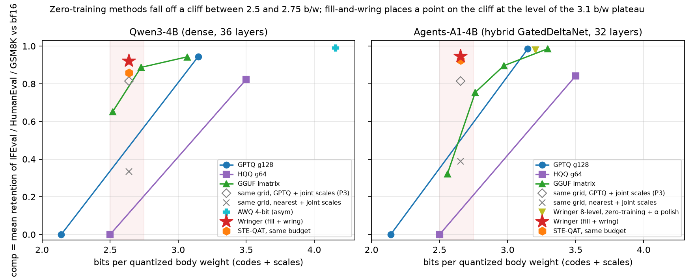

# Wringer: Capability Recovery by Fill-and-Wring Quantization at 2.6 Body Bits per Weight

**Technical report, draft v0.2 (2026-09-16).** Two 4B reasoning models, three benchmarks. This revision corrects experimental provenance, narrows attribution claims, and separates storage and training costs; it adds no experimental runs.
Companion article (first model, narrative): `HF_ARTICLE_wringer.md`. Models: [Agents-A1-4B-Wringer-Q2.6](https://huggingface.co/wcamon/Agents-A1-4B-Wringer-Q2.6), [Qwen3-4B-Wringer-Q2.6](https://huggingface.co/wcamon/Qwen3-4B-Wringer-Q2.6). Code and pre-registrations: https://github.com/wcAmon/wringer.

## Abstract

The tested zero-training quantizers degrade at low bit budgets on two 4B reasoning models, with the location and severity of degradation depending on the model and method. Some 2-bit GPTQ and HQQ configurations collapse on HumanEval under a 16k generation budget; other subjects were partly skipped under the stopping rule, so these are not measurements of zero accuracy on all three benchmarks.

**Wringer** combines fixed-grid quantization, frozen quantized weights with a rank-128 self-distilled bypass, and a final re-solve of codes and scales that removes the bypass. At **2.638 / 2.655 bits per quantized body weight**, the mean of three benchmark retention ratios (**comp**) rises from **0.814 / 0.814** for our same-configuration zero-training GPTQ baseline to **0.922 / 0.943** after one fill-and-wring round on Qwen3-4B / Agents-A1-4B. Published-container re-evaluation gives **0.917** for Qwen; the published two-round A1 model gives **0.947**. Neither model reaches the pre-registered 3-bit GPTQ minus 0.02 target. No adapter is shipped, and the body bit ledger is unchanged.

E71 compares against a specific rank-128 LoRA-and-scale STE-QAT control at the same step and token-slot budget: comp is 0.858 / 0.926. Qwen's gap exceeds the pre-registered decision threshold; A1 falls within E71's parity band. E73 isolates finisher choices on the same one-round filled weights for Qwen: nearest-point codes plus joint scales improve comp by 0.064 over scale search. An audit found that A1's E73 nearest-point arms instead used second-round filled weights while the GPTQ reference used one round; this comparison cannot isolate solver effects. E74 confirms that nearest-point plus joint scales alone is weak without training, but its A1 recovery comparison also spans two rounds.

One round processes about 98.3M token slots by repeatedly sampling a corpus of at most 2.1M token slots. Recorded A1 fill runtime is 7.13 GPU-hours for one round and 14.28 GPU-hours cumulatively for the published two-round model, excluding corpus generation, quantization, and evaluation; Qwen fill takes about 7.8 GPU-hours. The 2.6-b/w claim describes body storage, not inference memory or speed: evaluation uses materialized bf16 weights.

## 1. Setup

### 1.1 Models

| | Qwen3-4B | Agents-A1-4B (Qwen3.5-4B base) |
|---|---|---|
| Layers | 36, all softmax attention | 32: 24 GatedDeltaNet linear attention + 8 gated full attention |
| Attention | 32 heads / 8 KV, head 128 | 16 / 4, head 256, output gate |
| MLP width | 9728 | 9216 |
| Quantized body | 3.633 B weights, 252 linears | 3.565 B weights, 200 linears (in_proj_a/b gates kept bf16) |
| Revision | `1cfa9a7` | pinned in `prereg_e69.json` |

Embedding (tied), norms, conv1d and the A1 vision tower stay bf16 and are excluded from the ledger. "b/w" throughout means bits per quantized body weight, codes plus scales. Whole-model download sizes: Qwen3-4B bf16 parent 8.04 GB; Wringer container 1.12 GiB (2.6385 b/w including safetensors headers) plus the bf16 embedding 0.78 GB and norms, i.e. 3.93 b/w over the whole language model with the embedding kept in bf16 (2.82 b/w if the embedding were stored at 4.5 b/w, not evaluated). A1 bf16 parent 9.08 GB (incl. vision tower); container 1.18 GiB. GGUF files quantize the embedding as well: whole-file 2.71 / 2.90 / 3.21 b/w for the three Qwen points whose body b/w are 2.52 / 2.73 / 3.07.

### 1.2 Benchmarks and the single judge

IFEval (prompt-level strict), HumanEval (pass@1, temperature 1.0), GSM8K (exact match), all in thinking mode with a 16k-token budget. **comp** = mean of the three retention ratios against the model's own bf16 anchor. HumanEval uses four sampling seeds for the main comparisons; exceptions with fewer seeds or legacy single runs are identified below or in the experiment records. Reported ± values are across-seed standard deviations, not confidence intervals. IFEval and GSM8K are generally single runs. Benchmark scores are the outcome criteria; validation cross-entropy, reconstruction error, training loss and code-flip rate are diagnostic instruments, not substitutes for capability evaluation.

Anchors: Qwen3-4B IF 82.53 / GS 95.00 / he 94.66 (vLLM, fp8 KV cache, 128 concurrent); A1 IF 92.79 / GS 95.53 / he 93.75 (vLLM, bf16 KV, 16 concurrent). The Qwen protocol was validated against the bf16-KV protocol on the parent before use. Protocol noise bands used in judgments: comp ±0.02 (Qwen), ±0.011 (A1); HumanEval four-seed mean ±1.3 pp. E71 and E73 use a comp decision/parity threshold of ±0.02 for both models. These empirical bands and pre-registered thresholds are not formal confidence intervals or significance tests; repeated training seeds and full benchmark uncertainty estimates are not available. A1 HumanEval uses 128 workers, while its IF/GS evaluations use 16.

### 1.3 Calibration corpus

128 rows × 16,384 token slots generated by the model itself in thinking mode (code / instruction-following / math prompts). The same rows are used for closed-form solves and filling. This is at most 2,097,152 corpus token slots, including padding; the approximately 98.3M slots processed per fill round are repeated exposure, not 100M unique tokens. Length masks exclude padding from the KD objective; effective non-padding token totals are not reported here.

A guided-completion memorization probe compares Qwen3-4B with A1 ([probe report](../../evidence/corkscrew/contam_probe_qwen3_4b.md)). It provides limited relative evidence, not a clean-data guarantee: the control may itself have memorized benchmark content, individual overlap metrics are mixed, and this probe does not directly audit calibration-corpus overlap with the test sets. Repeated benchmark-guided recipe selection is a separate limitation (§5).

## 2. Method

**Grid and ledger.** Per module: a sign-aware even grid (4-, 8- or 16-level = 2/3/4 bit codes, or int8 per-row for k/v projections), block-128 scales in fp16 (Qwen) or int8 + fp16 row scale (A1). Module maps were chosen by per-module sensitivity probes to land at ≤ 2.70 b/w:

- Qwen3-4B p3a: k/v int8 row; q, o 8-level; gate/up/down 4-level → 2.638 b/w.
- A1 p3b: k/v int8 row; o 16-level; in_proj_z, in_proj_qkv, gate, out_proj 4-level; up/down 8-level; scales int8 → 2.655 b/w.

**Closed-form solve (the "wring" operator).** Collect the input second moment Σ per module on the calibration rows, propagating through already-quantized preceding layers. Solve codes (GPTQ with full Σ, or nearest-point rounding), then re-solve *all* block scales of the module jointly by least squares against Σ with a Tikhonov prior toward the search initialization (λ = 0.01). The prior is retained because the tested unregularized configuration failed: without it the joint solution drifts in the null space of Σ (calibration error 0, dense weight error 44 %, HumanEval −6 pp; experiment E65-X).

**Fill.** Materialize the quantized weights, freeze them, attach `W_q + B·A/r`, r = 128, to every quantized linear, and train A and B by KL distillation to the bf16 parent. Each round uses 3000 steps × batch 2 × 16,384 slots = 98,304,000 processed token slots, about 46.875 corpus passes. The KL at the `</think>` token is weighted 32× and the eight tokens after it 16×. This targets observed termination failures; it does not assume that all benchmark errors are termination failures. There is no early stopping.

**Wring.** Apply the code-and-scale solve again with `W_q + BA/r` as the target, using the same module map, then discard the adapter. The body ledger is unchanged. The historical absorption statistic is specifically `ρ_HE = (HE_wrung − HE_zero)/(HE_filled − HE_zero)`, not comp: Qwen's original GPTQ finisher gives about 0.87 using HE 72.87 → 79.88 → 78.96 (two-seed zero/fill means, four-seed wrung mean). A1's original one-round single-seed gate gives about 1.47 using 70.73 → 79.88 → 84.15. These differently sampled, version-specific diagnostics are not absorption estimates for the current published models and do not establish statistically reliable improvement over the attached-adapter model.

**Finisher selection.** The published Qwen v0.3 uses nearest-point codes plus joint scales; A1 uses GPTQ plus joint scales. Qwen's same-target ablation supports this choice for that model. A1's E73 provenance mismatch prevents a matched solver comparison (§4.2).

### 2.1 Training and deployment accounting

Hardware: one RTX PRO 6000 Blackwell, 96 GB. Fill runtimes are recorded wall times of the fill jobs; they exclude corpus generation, initial quantization, final wring, evaluation, and the broader recipe-search budget.

| Model / artifact | Fill rounds | Cumulative processed token slots | Fill job time |
|---|---:|---:|---:|
| Qwen3-4B, one-round variants | 1 | 98.3M | approximately 7.8 GPU-hours |
| A1 `p3b_w` | 1 | 98.3M | 7.13 GPU-hours (25,675.8 s) |
| A1 `p3b_w2`, published | 2 | 196.6M | 14.28 GPU-hours (25,675.8 + 25,726.9 s) |

Sources: `prereg_e70_qwen3_4b.json` and the A1 [first-round](../../evidence/corkscrew/fill_res69_p3b.json) / [second-round](../../evidence/corkscrew/fill_res69_p3b_w2.json) fill records. A1's reported comp increase from 0.943 to 0.947 is small relative to the decision bands; it does not establish a repeatable benefit from doubling the fill budget.

The body ledger excludes embeddings and other bf16 parameters. For A1, the [published-container ledger](../../evidence/corkscrew/pack_p3b_w2.json) gives **4.688 bits per whole language-model parameter** with bf16 embeddings and other language-model parameters included, versus **2.655 body b/w**; the vision tower is outside this language-model denominator. A validated whole-model Qwen ledger is not supplied here: its current packing record has zero embedding/other counts and must not be interpreted as a whole-model estimate. Evaluation materializes bf16 weights, so neither body ledger establishes 2.6-b/w inference memory or speed. Conversion to GPTQ-4bit/Marlin was demonstrated for A1, but that is a separate runtime representation.

## 3. Main result: recovery at a fixed body bit budget

All benchmark scores were measured by us under the protocols of §1.2; collapsed comp entries marked ‡ are assigned by the stopping convention, not measured three-subject means. "interp" = linear interpolation between the two neighbouring points of that method; where the lower neighbour is a collapsed point the interpolation carries no curve information and is reported only because the pre-registration asked for it.

### 3.1 Qwen3-4B (anchor IF 82.53 / GS 95.00 / he 94.66)

| Point | b/w | IFEval | GSM8K | HumanEval | comp |
|---|---:|---:|---:|---:|---:|
| AWQ 4-bit g128 asym (llm-compressor) | 4.156 | 83.36 | 91.05 | 94.51 ± 1.32 | 0.989 |
| AWQ 4-bit g128 sym | 4.125 | 81.33 | 57.54 | 93.75 ± 1.35 | 0.861 † |
| HQQ 3-bit g64 | 3.500 | 74.86 | 82.71 | 65.55 ± 1.76 | 0.823 |
| GPTQ 3-bit g128 | 3.148 | 78.19 | 91.96 | 87.04 ± 2.19 | 0.945 |
| GGUF IQ3_XXS (imatrix, UD-style protection) | 3.066 | 77.26 | 92.42 | 87.20 (2 seeds) | 0.943 |
| GGUF IQ2_M | 2.727 | 71.90 | 88.32 | 81.40 (2 seeds) | 0.887 |
| **Wringer, nearest-point + joint scales (e73_q_rtnj; research state; published v0.3 re-evaluation in parentheses)** | **2.638** | 79.11 (78.56) | 88.25 (87.87) | 83.23 ± 2.25 (82.62 ± 2.46) | **0.922 (0.917)** |
| **Wringer, GPTQ + joint scales (p3a_w; research state; published v0.2 re-evaluation in parentheses)** | **2.638** | 78.56 (75.42) | 88.70 (89.16) | 78.96 ± 1.17 (83.38 ± 2.07) | **0.907 (0.911)** |
| same-step/token-slot STE-QAT control (E71) | 2.638 | 74.68 | 84.31 | 74.09 ± 3.64 | 0.858 |
| zero-training, same grid, GPTQ + joint scales (P3) | 2.638 | 74.12 | 73.62 | 72.87 (2 seeds) | 0.814 |
| zero-training, same grid, nearest-point + joint scales (E74) | 2.638 | 37.89 | 36.77 | 14.94 ± 3.05 | 0.335 |
| GGUF IQ2_S | 2.519 | 53.23 | 77.41 | 46.95 (2 seeds) | 0.652 |
| HQQ 2-bit g64 | 2.500 | 0.00 | — | 0 (4 seeds) | 0 ‡ |
| GPTQ 2-bit g128 | 2.141 | — | — | 0 (4 seeds) | 0 ‡ |

† AWQ symmetric 4-bit is a genuine behaviour, not a toolchain error: in 484/1319 GSM8K prompts the model writes the final answer inside `<think>` and emits EOS without `</think>`; the reasoning parser returns empty content. A 150-prompt probe: 55 empty, 54 of them EOS-in-think, all 55 correct if the thinking segment is scored; with thinking disabled accuracy is 0.907 and no response is empty. The asymmetric (zero-point) variant has 49 empties and comp 0.989. This demonstrates sensitivity of thinking termination and parser-visible answers to this quantization configuration. The interpretation that a thin RL-trained termination increment is disrupted remains a hypothesis. The asymmetric point is the 4-bit anchor.
‡ Collapsed: HumanEval scores 0, with samples exhausting the 16k budget without closing `<think>`. “—” means not evaluated under the pre-registered stopping rule; Qwen HQQ IFEval was measured as 0.00. The displayed comp of 0 is a protocol-assigned collapse value, not evidence that all three subjects were measured as zero.

### 3.2 Agents-A1-4B (anchor IF 92.79 / GS 95.53 / he 93.75)

| Point | b/w | IFEval | GSM8K | HumanEval | comp |
|---|---:|---:|---:|---:|---:|
| HQQ 3-bit g64 | 3.500 | 76.34 | 88.70 | 72.71 ± 2.74 | 0.842 |
| GGUF U34 (IQ3-class) | 3.295 | 91.87 | 94.16 | 92.68 | 0.986 |
| Wringer P1-alpha (8-level, zero-training + α polish) | 3.206 | 90.94 | 95.38 | 90.85 | 0.980 |
| GPTQ 3-bit g128 | 3.148 | 90.76 | 94.69 | 92.38 ± 1.45 | 0.985 |
| GGUF U30 | 2.972 | 85.03 | 90.83 | 77.44 | 0.896 |
| GGUF U27 (IQ2_M-class) | 2.763 | 73.38 | 76.65 | 63.41 | 0.755 |
| **Wringer, two fill-and-wring rounds (p3b_w2; published, materialized)** | **2.655** | 88.17 | 93.48 | 85.37 ± 1.32 | **0.947** |
| **Wringer, one round, GPTQ + joint scales (p3b_w)** | **2.655** | 87.80 | 92.95 | 85.37 ± 2.63 | **0.943** |
| Wringer, second-round fill target, nearest-point + search scales (E73) | 2.655 | 87.43 | 92.19 | 84.76 ± 3.23 | 0.937 |
| same-step/token-slot STE-QAT control (E71) | 2.655 | 87.99 | 92.57 | 80.79 ± 0.35 | 0.926 |
| Wringer, second-round fill target, nearest-point + joint scales (E73) | 2.655 | 86.51 | 92.57 | 82.16 ± 0.91 | 0.926 |
| zero-training, same grid, GPTQ + joint scales (P3 = p3b) | 2.655 | 75.97 | 83.70 | 70.73 | 0.814 |
| zero-training, same grid, nearest-point + joint scales (E74) | 2.655 | 34.20 | 58.07 | 17.84 ± 1.15 | 0.389 |
| GGUF U25 (IQ2_XXS-class) | 2.558 | 34.38 | 36.54 | 20.12 | 0.322 |
| HQQ 2-bit g64 | 2.500 | — | — | 0 (4 seeds) | 0 ‡ |
| GPTQ 2-bit g128 | 2.141 | — | — | 0 (4 seeds) | 0 ‡ |

AWQ is absent on A1: llm-compressor's smoothing pass does not support the GatedDeltaNet forward signature (pre-registered risk). The high-retention comparator is GPTQ 3-bit at 0.985; it is not a measured 4-bit point. The ‡ stopping convention is defined below the Qwen table.

### 3.3 Reading the two tables

*Figure 1. comp (mean three-subject retention) against body bits per weight. Lines: zero-training methods measured by us (GPTQ, HQQ, llama.cpp GGUF imatrix); grey markers: our own grid at zero training with the two code solvers; star: fill-and-wring; hexagon: same-budget STE-QAT. Shaded: the 2.5–2.75 b/w band where every zero-training method loses more than a third of its score. Source: `fig_collapse_curve.py`.*

- **Low-bit degradation depends on the method and model.** GGUF falls from 0.943 → 0.887 → 0.652 on Qwen at 3.066 / 2.727 / 2.519 b/w, and from 0.896 → 0.755 → 0.322 on A1 at 2.972 / 2.763 / 2.558 b/w. HQQ already retains only 0.823 / 0.842 at 3.500 b/w, while our zero-training GPTQ retains about 0.814 at 2.638 / 2.655 b/w. These observations do not establish a universal cliff or common plateau.
- **The strongest direct recovery comparison is at an identical ledger.** One round improves comp from 0.814 to 0.922 on Qwen and from 0.814 to 0.943 on A1, approximately +0.108 / +0.129, relative to our zero-training GPTQ-plus-joint-scales baseline. Qwen's published-container re-evaluation is 0.917. Both models still trail 3-bit GPTQ (0.945 / 0.985), while using about 0.510 / 0.493 fewer body bits per weight.
- **Interpolation is descriptive, not a measured matched-budget baseline.** The historical GPTQ/HQQ interpolations connect collapsed 2-bit endpoints to 3-bit endpoints. They neither establish achievable accuracy at 2.6 b/w nor identify a curve shape; the sparse GGUF points likewise cannot locate a precise threshold.
- **E72 decision criteria.** J1 (above the interpolated GPTQ 2↔3-bit value) passes under the stated convention. J2 (3-bit GPTQ minus 0.02) fails for both models, even using the later best reported scores: Qwen 0.922 < 0.925; A1 0.947 < 0.965. GPTQ interpolates above HQQ, but this is not a matched-budget ranking. Qwen AWQ-asymmetric 4-bit retains 0.989 at 4.156 b/w, about 1.518 b/w above Wringer; A1 GPTQ-3 retains 0.985 at 3.148 b/w, only 0.493 b/w above Wringer.
- **Architecture explanations remain hypotheses.** The sampled GGUF curves have different shapes. Gating, recurrent-state sensitivity and thinking termination could contribute, but two models and sparse points do not isolate these factors.

## 4. Where the gain comes from

E71, E73 and E74 use the model-specific module maps, calibration rows and evaluation protocols recorded in their pre-registrations. The v0.2 provenance audit changes the interpretation of A1 E73; original experiment records remain historical records, not corrected evidence of a matched comparison.

### 4.1 E71 — comparison with a specific STE-QAT control

The control uses 3000 steps × batch 2 × 16k, the same KD and closure-weighting objective, and rank-128 LoRA before hard quantization plus trainable scale logits. It is one STE-QAT implementation, not a representative test of all QAT methods. Its learning rates are 1e-4 for LoRA and 3e-4 for scale logits, versus 2e-4 for fill. A1's starting quantized state was reconstructed after deletion and passed a HumanEval tolerance gate; bitwise identity to the original starting state was not established. Equal steps/token slots do not imply equal total pipeline compute or equally optimized hyperparameters.

| comp at same b/w | Qwen3-4B | A1 |
|---|---:|---:|
| E71 STE-QAT control | 0.858 | 0.926 |
| One-round Wringer (GPTQ finisher) | 0.907 | 0.943 |
| STE minus Wringer | −0.048 | −0.017 |

Qwen's gap exceeds the pre-registered 0.02 threshold; A1 lies within E71's ±0.02 parity band, with most of its gap in HumanEval. These are threshold-based judgments, not formal statistical significance or equivalence tests. Final code changes relative to initialization were about 1.26% on Qwen and 0.29% on A1. Low final flip rates do not establish identical training trajectories or rule out intermediate code changes.

### 4.2 E73 — finisher ablation and the A1 provenance correction

For Qwen, the three finishers use the same first-round filled target `exports/e70_p3a_resA`. E71 is a separately trained reference, not a fourth finisher on these weights.

| Qwen3-4B, comp | Result |
|---|---:|
| Nearest-point codes + block scale search | 0.8585 |
| Nearest-point codes + joint scales | 0.9223 |
| GPTQ codes + joint scales | 0.9066 |
| Separately trained E71 STE reference | 0.8583 |

On this Qwen target, replacing scale search with joint scales improves comp by 0.0638 (HumanEval approximately +8 pp). Replacing nearest-point codes with GPTQ codes under joint scaling changes comp by −0.0157. The similarity of 0.8585 and E71's 0.8583 is an outcome observation; it does not prove equivalent training dynamics or that the entire STE gap is caused by its finisher. Applying the same joint-scale finisher to E71 latent weights would provide the missing crossed control.

**A1 correction.** `chain_e69_s3w.sh` produces the first-round target `exports/e69_p3b_resA`, which leads to `p3b_w`. `chain_e69_w2.sh` then fills `p3b_w` to produce `exports/e69_p3b_w_resA`, which leads to `p3b_w2`. Both A1 E73 nearest-point arms use this **second-round** target (`chain_e73_collapse.sh`), but the recorded GPTQ comparator is **first-round** `p3b_w`.

| A1, comp | Target / training provenance | Result |
|---|---|---:|
| E73 nearest-point + search scales | Second-round filled target | 0.937 |
| E73 nearest-point + joint scales | Same second-round filled target | 0.926 |
| Recorded GPTQ reference `p3b_w` | First-round filled target | 0.943 |
| Research-state `p3b_w2` (GPTQ + joint scales on the **same** second-round target; four-seed HumanEval 86.74 ± 2.74, IF 86.32, GS 92.49; `he_multiseed_e69.md`) | Second-round filled target; same export path and E69 protocol as the E73 arms | 0.941 |
| Published `p3b_w2`, materialized | Second-round GPTQ lineage; published-container evaluation | 0.947 |
| E71 STE reference | Separate 3000-step training run | 0.926 |

The two nearest-point arms isolate the scale procedure on the same second-round target; joint scales change comp by about −0.011. The recorded GPTQ comparator `p3b_w` does **not** isolate solver choice. The matched comparator is the research-state `p3b_w2` row: it was solved by GPTQ + joint scales on the same `exports/e69_p3b_w_resA` target, exported through the same path and evaluated under the same protocol with four HumanEval seeds (comp 0.941 by the four-seed mean; its single-seed historical value was 0.947). Against it, nearest-point + joint scales is −0.015 and nearest-point + search scales −0.004 — the opposite sign to Qwen, and within about 1.5× A1's ±0.011 band. Solver choice is therefore second-order and model-dependent in sign; the joint-scale effect on A1 (−0.011 vs. search) is also inside the band. The published-container score 0.947 is not used for this comparison. A1 E73 cannot serve as a same-training-budget comparison to one-round E71.

### 4.3 E74 — nearest-point plus joint scales without training

E74 applies nearest-point plus joint scales directly to the bf16 parent, at the same ledger. The resulting comp values are 0.335 / 0.389.

| Model / finisher | Zero-training comp | Trained comp | Training provenance |
|---|---:|---:|---|
| Qwen GPTQ + joint scales | 0.814 | 0.907 | One fill round |
| Qwen nearest-point + joint scales | 0.335 | 0.922 | Same one-round filled target |
| A1 GPTQ + joint scales | 0.814 | 0.943 | One fill round |
| A1 nearest-point + joint scales | 0.389 | 0.926 | Second-round filled target |

Qwen's improvement is approximately +0.587 with nearest-point finishing and +0.093 with GPTQ finishing. A1's corresponding observed differences are +0.537 after two rounds and +0.129 after one round. They support recovery through the trained pipeline, but are not a common per-round treatment effect. In particular, +0.54–0.59 is relative to a weak nearest-point baseline, not the improvement over the stronger zero-training GPTQ baseline. At zero training GPTQ outperforms nearest-point by about +0.48 / +0.43; A1's post-training solver effect remains unresolved because of §4.2.

### 4.4 Supported interpretation and open mechanism questions

The evidence supports a practical capability-recovery pipeline: self-distill into a temporary bypass, then absorb it into the fixed-budget representation. On Qwen, joint scale solving improves the final benchmark outcome on fixed filled weights. Calling these weights “grid-friendly” is a functional interpretation of successful projection, not a measured claim that the bf16 parent is geometrically far from every grid point.

**Weight-space instrument (added in v0.2; diagnostic, not a judgment).** `instr_gridfriendly.py` measures, per quantized module and pooled over the body, the relative Frobenius residual between the target the finisher was given and that target's own nearest-point + joint-scale representation, and the fraction of codes on which two solvers disagree. Targets are matched by provenance: Qwen uses the bf16 parent vs. the first-round `e70_p3a_resA` target (comparators `e74_q_rtnj0`, `e73_q_rtnj`, `e70_p3a_w`, frozen start `e70_p3a`); A1 uses the bf16 parent vs. the second-round `e69_p3b_w_resA` target (comparators `e74_a_rtnj0`, `e73_a_rtnj`, GPTQ `p3b_w2`, frozen start `p3b_w`).

| | Qwen3-4B | A1 |
|---|---:|---:|
| relative residual, bf16 parent → its nearest joint-scale representation | 0.459 | 0.346 |
| relative residual, filled target → its nearest joint-scale representation | 0.074 | 0.019 |
| codes on which nearest-point and GPTQ disagree, bf16 parent | 18.4 % | 19.5 % |
| codes on which nearest-point and GPTQ disagree, filled target | 1.65 % | 0.19 % |
| codes changed by that fill round (nearest on filled target vs. the codes frozen during the fill) | 2.6 % | 0.24 % |

What this measures: the filled target is, by construction, a rank-128 perturbation of a point on the grid, and the distillation kept it within 2–7 % (relative norm) of a grid representation, whereas the bf16 parent is 35–46 % away from its best nearest-point representation under the same scale solve. It does not measure distance to *every* grid point, nor does it show that the parent could not be represented well by a different solver. It does explain two outcomes above: at zero training the two solvers disagree on about a fifth of the codes and the disagreement matters (0.34 vs 0.81); on the filled targets they disagree on 1.7 % (Qwen) and 0.2 % (A1), which is why the matched solver comparisons in §4.2 fall inside the noise bands on both models. The bypass is absorbed mostly into the scales; the round changes 2.6 % (Qwen, first round) and 0.24 % (A1, second round) of the codes. Files: `evidence/…/instr_gridfriendly_{qwen,a1}.json` (per-grid and per-module-type breakdowns).

The mechanism claim that STE gradients necessarily push latent weights into positions that round badly is untested here. Likewise, low final code-flip rates alone do not quantify how much recovery is carried by scales. Direct scale training, STE latent weights with the same final joint solve, and an A1 solver comparison with aligned fill provenance are needed to distinguish training-trajectory and projection effects. No such new runs are reported in this revision.

### 4.5 Context: published trained low-bit methods (not compared head-to-head)

The cliff in §3 is a cliff for *zero-training* methods and for one same-budget QAT control. Trained extreme-quantization methods in the literature also report escaping it, on different models and metrics. The table lists what each paper reports for Llama-2 at ~2 bits per parameter, with retention computed *within each paper's own table* (their quantized average ÷ their fp16 average; the zero-shot suites differ between papers, so the absolute averages are not comparable across rows).

| Method | Model | bits/param (as reported) | fp16 → quantized (paper's metric) | retention |
|---|---|---:|---|---:|
| AQLM [1] | Llama-2-7B / 13B / 70B | 2.02 / 1.97 / 2.07 | zero-shot avg 62.35→57.28 / 65.38→61.32 / 70.17→68.75 | 0.919 / 0.938 / 0.980 |
| QuIP# + FT [2] | Llama-2-7B / 13B / 70B | 2 | WikiText-2 ppl 5.47→6.66 / 4.88→5.74 / 3.32→4.16 | — (ppl) |
| PV-Tuning [3] | Llama-2-7B / 13B / 70B | 2.02 / 1.97 / 2.07 | zero-shot avg 64.80→61.35 / 67.82→64.92 / 72.40→70.72 | 0.947 / 0.957 / 0.977 |
| QTIP + FT [4] | Llama-2-7B / 13B / 70B | 2 | WikiText-2 ppl 5.12→5.86 / 4.57→5.11 / 3.12→3.70 | — (ppl) |
| EfficientQAT [5] | Llama-2-7B / 13B / 70B | w2g64 (≈2.3 with scales) | zero-shot avg 64.85→60.14 / 67.81→63.48 / 72.41→69.48 | 0.927 / 0.936 / 0.960 |
| EfficientQAT [5] | Llama-2-7B / 13B / 70B | w3g128 (≈3.1) | zero-shot avg 64.85→64.02 / 67.81→67.28 / 72.41→71.76 | 0.987 / 0.992 / 0.991 |
| **Wringer (this report)** | Qwen3-4B / A1-4B | 2.64 / 2.66 | generative thinking-mode IFEval+HumanEval+GSM8K mean | **0.922 / 0.947** |

Three things keep these rows from being a head-to-head comparison, and we did not run them: (a) the models are 7–70B base models, not 4B post-trained reasoning models, and retention improves with scale in every row; (b) the metrics are multiple-choice zero-shot accuracy or perplexity, not generation with a 16k thinking budget — the failure mode that produces our zeros (thinking never terminates) does not exist in those suites; (c) bits/param accounting differs (codebook methods count codebooks and per-group scales differently; EfficientQAT's w2g64 stores fp16 scales and zeros per 64 weights). What the table does establish is that the *trained* methods of record report 0.92–0.98 retention at ~2–2.3 bits on their metrics, i.e. the cliff is a property of zero-training and of naive QAT, not of the bit budget. Our contribution is not a better point on that Pareto front; it is (i) the same-model, same-protocol, same-calibration measurement of the cliff on generative reasoning tasks, and (ii) the attribution in §4.1–4.3 of where a trained method's escape comes from.

[1] Egiazarian et al., *Extreme Compression of Large Language Models via Additive Quantization*, arXiv:2401.06118 (Table 1). [2] Tseng et al., *QuIP#*, arXiv:2402.04396 (Tables 2–3). [3] Malinovskii et al., *PV-Tuning*, arXiv:2405.14852 (Table 2). [4] Tseng et al., *QTIP*, arXiv:2406.11235 (Table 5). [5] Chen et al., *EfficientQAT*, arXiv:2407.11062 (main table, w2g64 / w3g128). Numbers transcribed 2026-09-16 from the arXiv HTML versions; ParetoQ (Liu et al., arXiv:2502.02631) reports the same qualitative transition between 2 and 3 bits under full QAT.

## 5. Limitations

- Three benchmarks, thinking mode only; no MMLU-class or agentic suites. Comp is an equal-weight mean of three retention ratios, not a measure of general capability.
- Two models, both 4B. Method rankings, degradation thresholds and solver preferences may change elsewhere.
- External baselines have only 2–3 points per method. Linear interpolation, especially from protocol-assigned collapsed endpoints, is not a measured accuracy curve.
- Both models fail the pre-registered 3-bit GPTQ minus 0.02 target. Qwen research-state and published-container comp are 0.922 and 0.917, respectively.
- A1 E73's recorded GPTQ comparator (`p3b_w`) is first-round while the nearest-point arms are second-round. The matched research-state `p3b_w2` comparator (§4.2) restores a same-target comparison, but it was not part of the pre-registered E73 design; the solver-effect reading on A1 is post hoc and within the noise band.
- HumanEval sampling seeds, empirical noise bands and decision thresholds do not provide full benchmark or training-seed uncertainty. No formal significance or equivalence claim is made.
- Repeated use of the same benchmarks to choose module maps, finishers and recipes creates selection/adaptation risk. Per-experiment pre-registration does not remove it. A frozen recipe evaluated on an independent holdout is needed; the parent memorization probe does not rule out contamination or directly audit calibration/test overlap.
- The body ledger is a storage metric. Whole-model storage, runtime representation, peak inference memory and throughput must be reported separately. No 2.6-b/w inference-memory or speed gain is demonstrated here.
- Training-cost comparisons must use cumulative fill rounds and separately account for corpus generation, quantization, evaluation and recipe search. A1's published model uses about 14.28 fill GPU-hours, versus 7.13 for one round; the small second-round score increase is not established as repeatable.
- Parser-visible answer failure and reasoning correctness can diverge (§3.1). Closure weighting targets one observed failure mode; it does not establish that termination alone explains all recovery.

Priority follow-ups are: align A1 E73 artifact provenance and evaluation state; apply identical finishers to fill and STE latent weights; evaluate a frozen recipe on independent benchmarks with uncertainty estimates; and complete whole-model storage and runtime accounting. These are open validation tasks, not results of this report.

## 6. Reproducibility

The experiment records contain pre-registered judgments and appended results: `prereg_e69.json` (A1), `prereg_e70_qwen3_4b.json` (Qwen3-4B), `prereg_e71_ste.json`, `prereg_e72_baselines.json`, `prereg_e73_collapse.json`, `prereg_e74_zerortnj.json`. The A1 E73 interpretation in this report supersedes the unmatched-comparator interpretation in the historical pre-registration; those source records are preserved. Per-prompt responses are under `evidence/a1eval/` (summaries and per-task scores in this snapshot). Pre-registration chronology should be audited through Git history rather than inferred solely from mutable result files. External baselines were produced with llm-compressor (GPTQ, AWQ), hqq, and llama.cpp on the same calibration rows; ledgers were recomputed by us over the same set of body linears.

## Appendix A. Changelog of the published models

- Agents-A1-4B-Wringer-Q2.6: p3b_w2 (two rounds), comp 0.947, 2.655 b/w.
- Qwen3-4B-Wringer-Q2.6 v0.2: p3a_w (GPTQ finisher), comp 0.907 (materialized 0.911). v0.3 (this report): e73_q_rtnj (nearest-point + joint scales finisher on the same filled weights), comp 0.922; materialized re-evaluation IF 78.56 / GS 87.87 / HumanEval 82.62 ± 2.46 → comp 0.9166 (same band as the research state; container R1 = R2 = R3 = 0).

## Appendix B. Report revision history

- **v0.2 addendum (2026-09-16, same day):** Add §4.5 literature context (AQLM, QuIP#, PV-Tuning, QTIP, EfficientQAT), Figure 1, the matched research-state `p3b_w2` comparator in §4.2, and the weight-space instrument in §4.4 (no new training or evaluation runs; the instrument is a CPU computation on existing states).
- **v0.2 (2026-09-16):** Correct A1 E73 nearest-point arms to second-round fill provenance and withdraw the unmatched solver attribution. Replace universal-cliff and general STE-mechanism claims with scoped observations. Distinguish skipped subjects from measured zeros, decision bands from statistical uncertainty, research states from published-container re-evaluations, and body storage from whole-model/runtime budgets. Add cumulative fill costs, repeated-token accounting, historical HumanEval-specific ρ definitions, and benchmark-selection/contamination limitations. Existing experimental scores are preserved; no new experiments were run for this revision.
- **v0.1 (2026-09-16):** Initial technical report.
